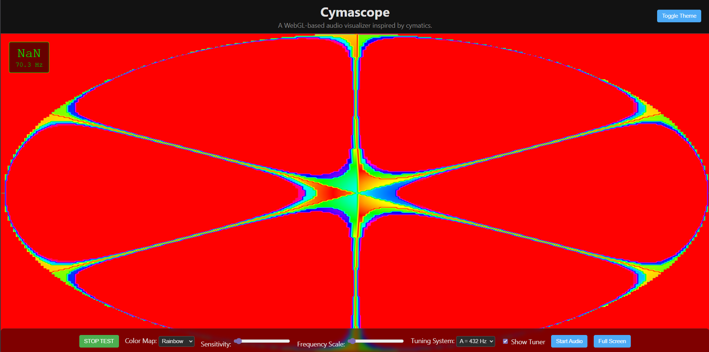

# Cymascope

A real-time, browser-based audio visualizer inspired by the principles of cymatics. This project uses the Web Audio API to capture microphone input and WebGL to render beautiful, intricate patterns that correspond to the frequencies in the sound.

<!-- It's recommended to replace this with a local screenshot, e.g.,  -->

## 🚀 Features

- **Real-time Audio Analysis**: Captures audio from your microphone and analyzes its frequency spectrum.
- **WebGL Rendering**: Uses hardware-accelerated graphics for high-performance, smooth animations.
- **Cymatic Patterns**: Generates visualizations based on Chladni figures, which are patterns formed by vibrating plates.
- **Customizable Visuals**:
  - **Color Maps**: Multiple palettes including Rainbow, Grayscale, and Heatmap.
  - **Sensitivity & Scaling**: Sliders to adjust visual intensity and frequency mapping.
  - **Fullscreen Mode**: An immersive, distraction-free viewing mode.
- **Musical Tuner**: An overlay that displays the dominant frequency and its closest musical note.
  - **Selectable Tuning**: Switch between A=440Hz and A=432Hz tuning systems.
- **Test Mode**: A built-in sine wave generator to test the visualization without a microphone.
- **Modern UI**: A clean, single-page layout with overlay controls and theme support.
  - **Light & Dark Themes**: Switch themes manually or sync with system preference.

## 🛠️ How It Works

The application works by mapping frequency data from an audio source to a weighted sum of several vibrational modes of a circular membrane. These modes are mathematically described by Bessel functions.

1.  **Audio Input**: The Web Audio API's `AnalyserNode` provides real-time frequency data (FFT).
2.  **Mode Mapping**: Each frequency bin from the FFT is mapped to the closest pre-defined vibrational mode (`k` value).
3.  **Weight Calculation**: The amplitude of the frequency bin contributes to the "weight" of its corresponding mode. These weights are smoothed over time for a more fluid animation.
4.  **GLSL Shaders**: A fragment shader receives these weights and an array of pre-rendered mode textures. It calculates the final pattern by summing the mode textures, multiplied by their dynamic weights.
5.  **Rendering**: The resulting pattern is colored using a selectable color map texture and rendered to a canvas.

##  Roadmap

See roadmap.md for planned features and future development goals.

## 🤝 Contributing

Contributions are welcome! Please read CONTRIBUTING.md for guidelines on how to get started.
